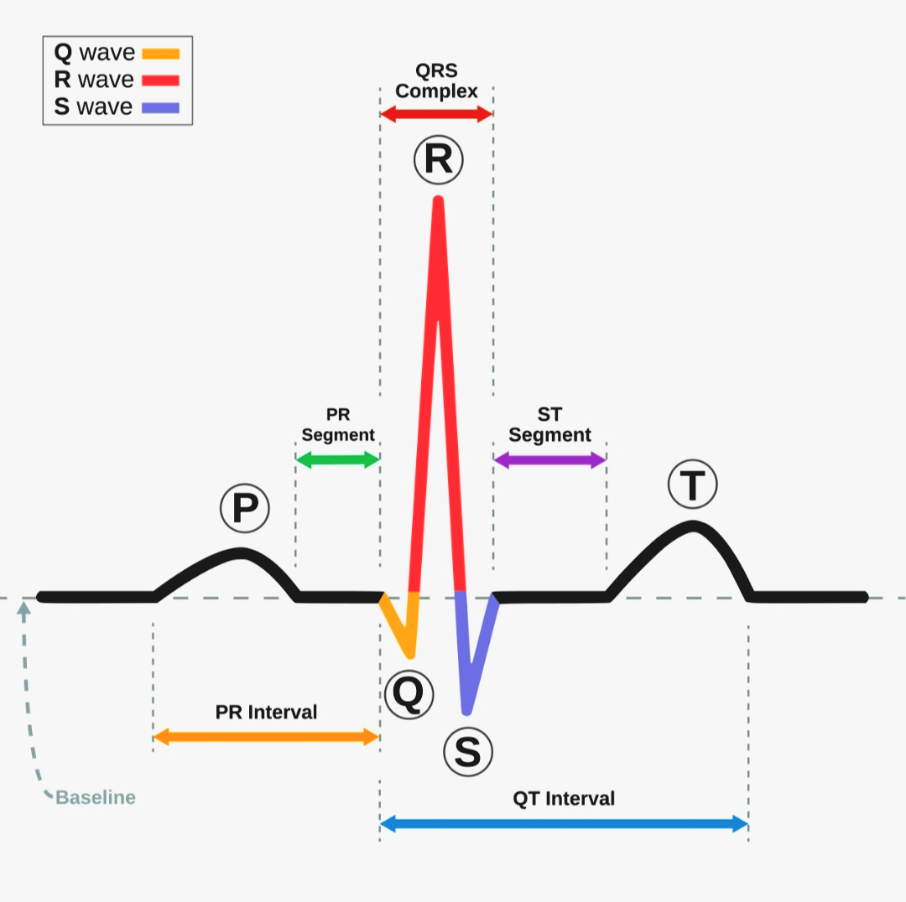
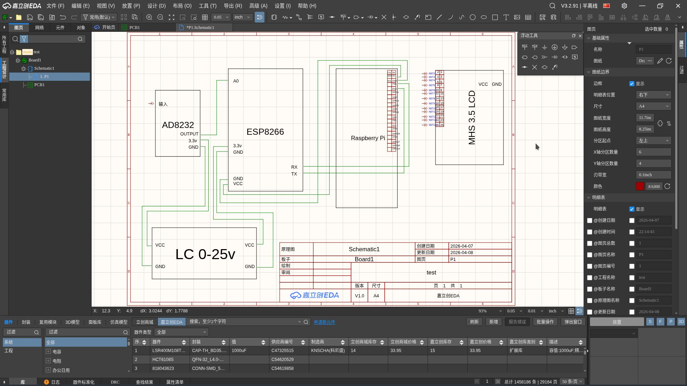
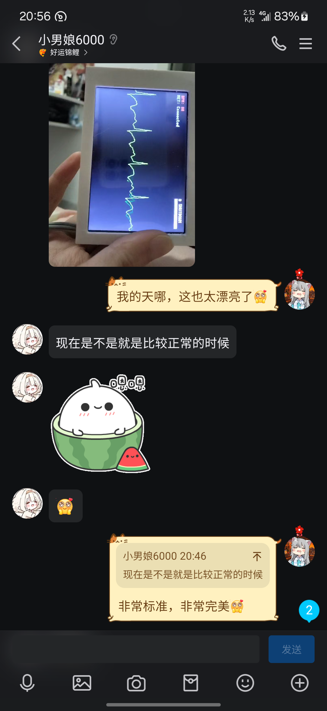

# AD8232-ECG-Monitor

Real-time ECG monitoring system using AD8232 sensor, ESP8266 microcontroller, Raspberry Pi Zero/Zero W, and MHS3.5 LCD display.

# Project Background:
Originally this was my personal hobby project, and I made a simplified version to enter in a competition. However, a few days later a friend who was approaching her college entrance exam told me she had symptoms resembling panic attacks, with heart palpitations, shortness of breath, and feelings of impending doom. Since she lived alone, I worked continuously for 15 hours to add UI interaction and remote monitoring features, hoping to help her and hoping I could face my former self with a clear conscience.

## Example ECG Waveforms


## Hardware Components
- AD8232 ECG Sensor Module
- ESP8266 Development Board
- Raspberry Pi Zero/Zero W (Please use the Zero W version if you want to use the network remote monitoring feature)
- MHS3.5 LCD Display (480x320 resolution)
- LC filtering module (0-25V)

## Electrode Placement Diagram


## Build and Deployment Guide

### 1. ESP8266 Setup
Upload the `ESP8266.ino` file to your ESP8266 board using Arduino IDE:
- Open `ESP8266.ino` in Arduino IDE
- Select appropriate board settings for your ESP8266
- Compile and upload the program

### 1.1 Using Remote Monitoring Feature
To use the remote monitoring feature, you need to configure your Raspberry Pi to connect to your WiFi network, and register a free account at [Sakura Frp](https://www.natfrp.com) and create a TCP tunnel.

### 2. Raspberry Pi Zero Setup
Connect your Raspberry Pi Zero/Zero W to the MHS3.5 LCD display and ensure proper wiring between ESP8266 and Pi:
- Connect the TX pin of ESP8266 to the RX pin (GPIO 15) of Raspberry Pi UART
- Ensure common ground connection between ESP8266 and Raspberry Pi
- MHS3.5 LCD connects to Raspberry Pi Zero via GPIO pins
##### As shown in the diagram below:


### 2.1 LCD Driver Installation
If using MHS3.5 LCD screen, install the corresponding drivers:
```bash
# Download LCD-show driver
git clone https://github.com/goodtft/LCD-show.git
chmod -R 755 LCD-show
cd LCD-show/
sudo ./MHS35-show
```

### 3. Environment Preparation
```bash
# Clone the repository on Target side:
git clone https://github.com/Amashiro-Natsuki0796/AD8232-ECG-Monitor.git
cd AD8232-ECG-Monitor

# Install dependencies
sudo apt-get update
sudo apt-get install build-essential nano gcc
# Configure wireless network connection
sudo raspi-config
```

### 4. Modify and Compile
```bash
# On Host side run:
cd Sakura-Frp/
./frpc
# Login to your account

# On Target side run:
cd AD8232-ECG-Monitor/
nano Main.c # Modify SERVER_IP to your IP address
make -j$(nproc)
sudo ./Main
```

### 5. Auto-start Service (Optional)
To automatically run the ECG monitor on startup:
```bash
# Copy service file to systemd
sudo cp ECG.service /etc/systemd/system/

# Enable and start the service
sudo systemctl enable ECG.service
sudo systemctl start ECG.service
```

## 3D Printed Enclosure Models
We provide 3D models for housing the electronics in a dedicated enclosure:
- Shell.STL - Main housing
- Bottom.STL - Bottom cover
- Stent.STL - Internal support structure

These SolidWorks models (.SLDPRT and .STL formats) are located in the `Shell Model` directory and can be 3D printed to create an enclosure for the ECG monitor.

## Demonstration Video
Watch the demonstration videos to see the ECG monitor in action:
[Development Phase](Attachment/ENG.mp4)
[Demo Video](Attachment/Demo.mp4)

## Demo Screenshots



## Alternative Display Solutions
As an alternative to PC-side visualization, Python-based plotting tools are provided:
Remote monitoring: `Attachment/ECG_network_plotter.py`
ESP8266 serial plotting: `Attachment/ECG_serial_plotter.py`
Host-side simulation data sending: `Attachment/ECG_simulator.py`