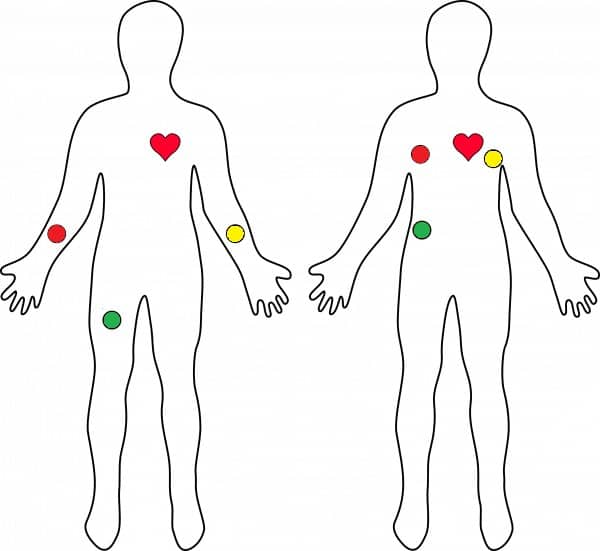
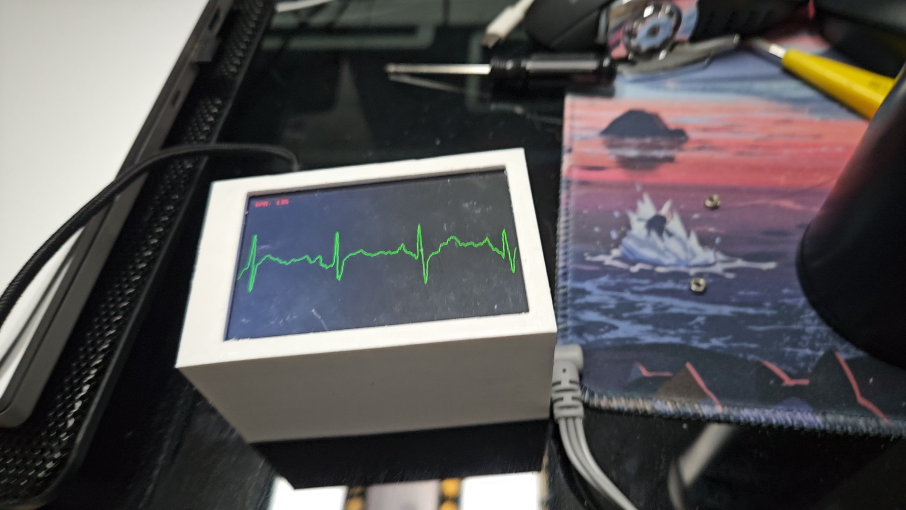

# AD8232-ECG-Monitor

Real-time ECG monitoring system using AD8232 sensor, ESP8266 microcontroller, Raspberry Pi Zero, and MHS3.5 LCD display.

## ECG Waves Sample


## Hardware Components
- AD8232 ECG Sensor Module
- ESP8266 Development Board
- Raspberry Pi Zero
- MHS3.5 LCD Display (480x320 resolution)
- LC Filter Module (0-25V)

## Electrode Placement Diagram


## Build and Deployment Guide

### 1. ESP8266 Setup
Upload the `ESP8232.ino` file to your ESP8266 board using Arduino IDE:
- Open `ESP8232.ino` in Arduino IDE
- Select appropriate board settings for your ESP8266
- Upload the sketch

### 2. Raspberry Pi Zero Setup
Connect your Raspberry Pi Zero to the MHS3.5 LCD display and ensure proper wiring between ESP8266 and Pi.

### 2.1 LCD Driver Installation
If using the MHS3.5 LCD screen, install the corresponding driver:
```bash
# Download LCD-show driver
git clone https://github.com/goodtft/LCD-show.git
chmod -R 755 LCD-show
cd LCD-show/
sudo ./MHS35-show
```

### 3. Environment Preparation
```bash
# Clone the repository
git clone https://github.com/Amashiro-Natsuki0796/AD8232-ECG-Monitor.git
cd AD8232-ECG-Monitor

# Install dependencies
sudo apt-get update
sudo apt-get install build-essential

# Compile the framebuffer display program
make
```

### 4. Running the Application
```bash
# Run directly
sudo ./ecg_serial_plotter_fb

# Or compile and run with make
make run
```

### 5. Auto-start Service (Optional)
To run the ECG monitor automatically on boot:
```bash
# Copy service file to systemd
sudo cp ECG.service /etc/systemd/system/

# Enable and start the service
sudo systemctl enable ECG.service
sudo systemctl start ECG.service
```

## 3D Printed Shell Model
We provide 3D models for housing the electronics in a professional enclosure:
- Shell.STL - Main enclosure shell
- Bottom.STL - Bottom cover
- Stent.STL - Internal support structure

These SolidWorks models (.SLDPRT and .STL formats) are located in the `Shell Model` directory and can be 3D printed to create a protective case for your ECG monitor.

## Wiring
- Connect ESP8266 TX pin to Raspberry Pi UART RX pin (GPIO 15)
- Ensure common ground connection between ESP8266 and Raspberry Pi
- MHS3.5 LCD connects via GPIO pins to Raspberry Pi Zero

## Demo Video
Check out the demonstration video to see the ECG monitor in action:
[Demo Video](demo.mp4)

## Finished Product


## Alternative Display
A Python-based plotting alternative is available as `Attachment/ecg_serial_plotter.py` for PC-based visualization.